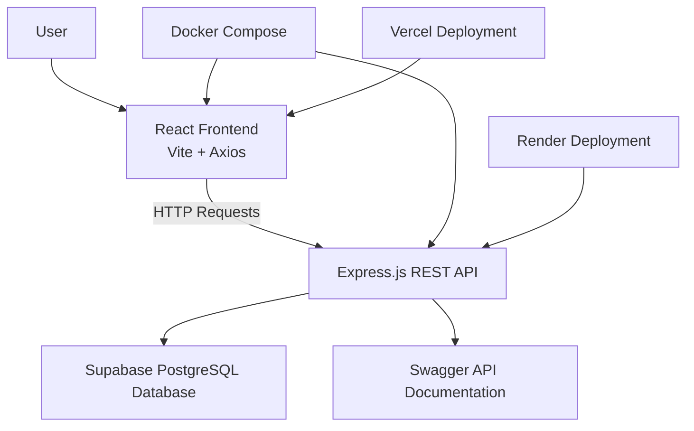

# 🚀 PasteBin - Full Stack Paste Sharing Application

A modern PasteBin web application that allows users to create, view, share, and delete text snippets. Built with React, Express.js, Supabase, and Docker, and deployed using Vercel and Render.

## 🌐 Live Demo

**Frontend:** https://pastebin-nu-two.vercel.app

**Backend API:** https://pastebin-backend-su7v.onrender.com

**Swagger API Docs:** https://pastebin-backend-su7v.onrender.com/api-docs

---

# ✨ Features

- 📝 Create text pastes
- 📋 View all pastes
- 🔍 View individual pastes
- 🗑 Delete pastes
- 🔗 Share pastes using the Web Share API
- 📖 Swagger API documentation
- 🐳 Docker support
- ☁️ Cloud deployment
- ⚡ Fast React frontend using Vite

---

# 🛠 Tech Stack

### Frontend
- React
- Vite
- React Router DOM
- Axios
- CSS

### Backend
- Node.js
- Express.js

### Database
- Supabase (PostgreSQL)

### API Documentation
- Swagger UI

### Deployment
- Vercel
- Render

### Containerization
- Docker
- Docker Compose

---

# 📂 Project Structure

```
Pastebin/
│
├── backend/
│   ├── routes/
│   ├── swagger/
│   ├── server.js
│   ├── Dockerfile
│   └── package.json
│
├── frontend/
│   ├── src/
│   │   ├── components/
│   │   ├── pages/
│   │   ├── services/
│   │   └── styles/
│   ├── Dockerfile
│   └── package.json
│
├── docker-compose.yml
└── README.md
```

---

# 🚀 Getting Started

## Clone the repository

```bash
git clone https://github.com/SudarshanUpadhyaya86/Pastebin.git
cd Pastebin
```

---

# Backend Setup

```bash
cd backend
npm install
```

Create a `.env` file inside the backend directory.

Example:

```env
SUPABASE_URL=YOUR_SUPABASE_URL
SUPABASE_KEY=YOUR_SUPABASE_ANON_KEY
PORT=5000
```

Start the backend:

```bash
npm start
```

Runs on:

```
http://localhost:5000
```

---

# Frontend Setup

```bash
cd frontend
npm install
npm run dev
```

Runs on:

```
http://localhost:5173
```

---

# 🐳 Running with Docker

Build and start the application:

```bash
docker compose up --build
```

Stop the containers:

```bash
docker compose down
```

---

## ❤️ Health Check

The backend provides a health check endpoint that can be used to verify whether the service is running.

### Endpoint

```
GET /healthz
```

### Local

```
http://localhost:5000/healthz
```

### Production

```
https://pastebin-backend-su7v.onrender.com/healthz
```

### Sample Response

```json
{
  "status": "OK",
  "message": "Pastebin backend is running",
  "timestamp": "2026-07-30T18:15:42.123Z"
}
```

A successful response indicates that the backend service is operational and ready to accept API requests.

---

## 📖 API Documentation

Interactive API documentation is available through Swagger UI.

### Local

```
http://localhost:5000/api-docs
```

### Production

```
https://pastebin-backend-su7v.onrender.com/api-docs
```

The documentation includes all available endpoints, request parameters, and example responses.

---

# 📡 API Endpoints

| Method | Endpoint | Description |
|----------|----------------|------------------------|
| POST | `/pastes` | Create a new paste |
| GET | `/pastes` | Get all pastes |
| GET | `/pastes/:id` | Get a single paste |
| PUT | `/pastes/:id` | Update a paste |
| DELETE | `/pastes/:id` | Delete a paste |

---

# 🔄 Application Architecture



---

# 🌍 Deployment

## Frontend

Hosted on **Vercel**

## Backend

Hosted on **Render**

## Database

Hosted on **Supabase**

---

# 🧭 Design Decisions

**No authentication.** Pastes are public and unowned — anyone can create,
view, edit, or delete any paste via its UUID. This was left out to keep the
project scoped and avoid adding extra complexity (auth flows, protected
routes, RLS policies) on top of everything else. It's the first thing I'd
add next — see Future Improvements below.

**Supabase over a self-managed DB.** Chosen for a managed Postgres instance
with a generous free tier and a JS client that removes the need to hand-roll
a connection pool / migrations for a project this size.

---

# 📌 Future Improvements

- User authentication
- Syntax highlighting
- Paste expiration
- Password protected pastes
- Search functionality
- Edit existing pastes
- Dark mode
- Copy to clipboard button
- Code language detection

---

# 👨‍💻 Author

**H. Sudarshan Upadhyaya**

GitHub: https://github.com/SudarshanUpadhyaya86

LinkedIn: https://linkedin.com/in/h-sudarshan-upadhyaya

---

# 📄 License

This project is developed for educational purposes.
